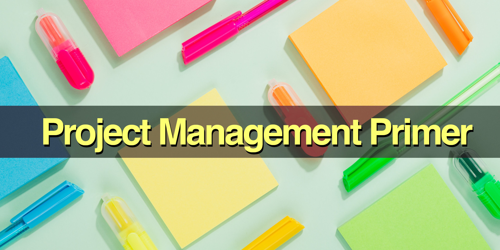

# Project Management Guide

Project Management Guide: this book explains one topic per page, like a big glossary, easy wiki, quick encyclopedia, or summary notes.

* Get the book: 
  [Free EPUB](https://github.com/SixArm/project-management-guide/raw/main/project-management-guide.epub),
  [Free PDF](https://github.com/SixArm/project-management-guide/raw/main/project-management-guide.pdf),
  [Gumroad](https://gumroad.com/l/project-management-guide),
  [Kindle](https://www.amazon.com/dp/B0CP8JMXBH),
  [Paperback](https://www.amazon.com/dp/B0CS6QCKQH).
* Edited by [Joel Parker Henderson](https://github.com/joelparkerhenderson).
* For questions and suggestions [email me](mailto:joel@joelparkerhenderson.com).
* For donations [PayPal me](https://paypal.me/joelparkerhenderson) or [Venmo me](https://account.venmo.com/u/joelparkerhenderson).

## Contents

### [Introduction](topics/project-management-guide-introduction)

### [Project management](topics/project-management)

* [Project management life cycle (PMLC)](topics/project-management-life-cycle)
* [Project portfolio management (PPM)](topics/project-portfolio-management)
* [Portfolio optimization](topics/portfolio-optimization)
* [Project versus program](topics/project-versus-program)
* [Outputs versus outcomes (OVO)](topics/outputs-versus-outcomes)

### [Inception](topics/inception)

* [Liftoff](topics/liftoff)
* [Agile chartering](topics/agile-chartering)
* [Project charter](topics/project-charter)

### [Ideation](topics/ideation)

* [North Star](topics/north-star)
* [Big Hairy Audacious Goal (BHAG)](topics/big-hairy-audacious-goal)
* [Vision, mission, values](topics/vision-mission-values)
* [Voice of the Customer (VoC)](topics/voice-of-the-customer)
* [Subject matter expert (SME)](topics/subject-matter-expert)
* [Mind map](topics/mind-map)
* [Decision tree](topics/decision-tree)

### [Creative thinking techniques](topics/creative-thinking-techniques)

* [Futurespective](topics/futurespective)
* [Brainstorming](topics/brainstorming)
* [Thinking hats](topics/thinking-hats)
* [SCAMPER](topics/scamper)
* [Oblique strategies](topics/oblique-strategies)
* [Flowchart](topics/flowchart)
* [Mental model](topics/mental-model)
* [The map is not the territory](topics/the-map-is-not-the-territory)

### [Intent plan](topics/intent-plan)

* [Objectives and Key Results (OKRs)](topics/objectives-and-key-results)
* [Key Performance Indicators (KPIs)](topics/key-performance-indicators)
* [Key Risk Indicators (KRIs)](topics/key-risk-indicators)
* [Critical Success Factors (CSFs)](topics/critical-success-factors)
* [Critical To Quality (CTQ)](topics/critical-to-quality)
* [Goals, Ideas, Steps, Tasks (GIST)](topics/goals-ideas-steps-tasks)
* [Risks, Actions, Issues, Decisions (RAID)](topics/risks-actions-issues-decisions)
* [SPADE decision framework](topics/spade-decision-framework)
* [Decision record](topics/decision-record)
* [SMART criteria](topics/smart-criteria)

### [Statement Of Work (SOW)](topics/statement-of-work)

* [Scope](topics/scope)
* [Scope creep](topics/scope-creep)
* [Out-of-scope](topics/out-of-scope)
* [Work Breakdown Structure (WBS)](topics/work-breakdown-structure)
* [Functional specifications](topics/functional-specifications) 
* [Functional specifications - steps](topics/functional-specifications-steps)
* [Software development life cycle (SDLC)](topics/software-development-life-cycle)
* [MoSCoW method](topics/moscow-method)
* [Gantt chart](topics/gantt-chart)
* [Quad chart](topics/quad-chart)

### [Project estimation](topics/project-estimation)

* [Planning poker estimation](topics/planning-poker-estimation)
* [T-shirt size task estimation](topics/t-shirt-size-task-estimation)
* [Fibonacci task estimation](topics/fibonacci-task-estimation)
  
### [Resource leveling](topics/resource-leveling)

* [Critical chain project management](topics/critical-chain-project-management)
* [Critical path project management](topics/critical-path-project-management)
* [Constraint satisfaction](topics/constraint-satisfaction)
* [Roll-on Roll-off (RoRo)](topics/roll-on-roll-off)

### [Project management methodologies](topics/project-management-methodologies)

* [Lean manufacturing](topics/lean-manufacturing)
* [Lean software development methodology](topics/lean-software-development-methodology)
* [Agile software development methodology](topics/agile-software-development-methodology)
* [Kanban](topics/kanban)
* [Scrum](topics/scrum)
* [Prince2](topics/prince2)

### [Change management](topics/change-management)

* [Six Sigma methodology](topics/six-sigma-methodology)
* [DMAIC methodology](topics/dmaic-methodology)
* [Plan-Do-Check-Act (PDCA)](topics/plan-do-check-act)
* [OODA loop](topics/ooda-loop)
* [OODA loop v DMAIC cycle v PDCA spiral](topics/ooda-loop-v-dmaic-cycle-v-pdca-spiral)
* [Kaizen (continuous improvement)](topics/kaizen)
* [ADKAR change management model](topics/adkar-change-management-model)
* [EBFAS organizational climate](topics/ebfas-organizational-climate)

## Design Development

* [Big design up front (BDUF)](topics/big-design-up-front)
* [Domain-Driven Design (DDD)](topics/domain-driven-design)
* [Behavior-Driven Development (BDD)](topics/behavior-driven-development)
* [Test-Driven Development (TDD)](topics/test-driven-development)

### [Modeling diagrams](topics/modeling-diagrams)

* [Activity diagram](topics/activity-diagram)
* [Sequence diagram](topics/sequence-diagram)
* [Use case diagram](topics/use-case-diagram)
* [Object diagram](topics/object-diagram)
* [Class diagram](topics/class-diagram)
* [Package diagram](topics/package-diagram)
* [Component diagram](topics/component-diagram)
* [Deployment diagram](topics/deployment-diagram)
* [State diagram](topics/state-diagram)
* [Timing diagram](topics/timing-diagram)
* [Entity-relationship diagram (ERD)](topics/entity-relationship-diagram)
* [Cause-and-effect diagram](topics/cause-and-effect-diagram)
* Fishbone diagram: see cause-and-effect diagram
* Ishikawa diagram: see cause-and-effect diagram
* [Unified Modeling Language (UML)](topics/unified-modeling-language)
* [PlantUML](topics/plantuml)
* [Mermaid.js](topics/mermaid-js)

## Teams

### [Teamwork](topics/teamwork)

* [Forming, Storming, Norming, Performing (FSNP)](topics/forming-storming-norming-performing)
* [Icebreaker questions](topics/icebreaker-questions)
* [Pizza team](topics/pizza-team)
* [Squad team](topics/squad-team)
* [Community of Practice (CoP)](topics/community-of-practice)
* [The Spotify Model](topics/the-spotify-model)
* [Ways Of Working (WOW)](topics/ways-of-working)
* [TEAM FOCUS](topics/team-focus)
* [Pair programming](topics/pair-programming)

### [Roles and responsibilities](topics/roles-and-responsibilities)

* [Organizational chart](topics/organizational-chart)
* [Chain of command](topics/chain-of-command)
* [Stakeholders](topics/stakeholders)
* [Responsibility assignment matrix (RAM)](topics/responsibility-assignment-matrix)
* [RACI matrix](topics/raci-matrix)
* [PARIS matrix](topics/paris-matrix)

### [Outsourcing](topics/outsourcing)

* [Offshoring](topics/offshoring)
* [Nearshoring](topics/nearshoring)

### [Meetings](topics/meetings)

* [Meeting types](topics/meeting-types)
* [All-hands meeting](topics/all-hands-meeting)
* [Standup meeting](topics/standup-meeting)
* [One-on-one meeting](topics/one-on-one-meeting)
* [Skip-level meeting](topics/skip-level-meeting)

## Larger Projects

### [Digital transformation](topics/digital-transformation)

* [Business information systems](topics/business-information-systems)
* [Line-of-business (LOB) application](topics/line-of-business-application)
* [Front-office applications](topics/front-office-applications)
* [Back-office applications](topics/back-office-applications)

### [Business continuity](topics/business-continuity)

* [Operational resilience](topics/operational-resilience)
* [Standard Operating Procedure (SOP)](topics/standard-operating-procedure)
* [Playbook](topics/playbook)
* [Runbook](topics/runbook)
* [Dialogic Organization Development](topics/dialogic-organization-development)

### [Quality control](topics/quality-control)

* [Program Evaluation and Review Technique (PERT)](topics/program-evaluation-and-review-technique)
* [After-Action Report (AAR)](topics/after-action-report)
* [Blameless retrospective](topics/blameless-retrospective)
* [Issue tracker](topics/issue-tracker)
* [Cynefin framework](topics/cynefin-framework)
* [Five Whys analysis](topics/five-whys-analysis)
* Non-functional requirements: see system quality attributes
* [Root cause analysis (RCA)](topics/root-cause-analysis)
* [System Quality Attributes (SQAs)](topics/system-quality-attributes)
* [Quality of Service (QoS) for networks](topics/quality-of-service-for-networks)
* [Good Enough For Now (GEFN)](topics/good-enough-for-now)
* [Technical debt](topics/technical-debt)
* [Refactoring](topics/refactoring)
* See also: cause and effect diagram

### [Statistical analysis](topics/statistical-analysis)

* [Descriptive statistics](topics/descriptive-statistics)
* [Inferential statistics](topics/inferential-statistics)
* [Correlation](topics/correlation)
* [Causation](topics/causation)
* [Probability](topics/probability)
* [Variance](topics/variance)
* [Trend analysis](topics/trend-analysis)
* [Anomaly detection](topics/anomaly-detection)
* [Quantitative fallacy](topics/quantitative-fallacy)
* [Regression to the mean](topics/regression-to-the-mean)
* [Bayes' theorem](topics/bayes-theorem)
* [Chi-square analysis](topics/chi-square-analysis)
* [Monte Carlo methods](topics/monte-carlo-methods)
* [Statistical analysis techniques](topics/statistical-analysis-techniques)

### [Artificial intelligence (AI)](topics/artificial-intelligence)

* [AI for project management](topics/ai-for-project-management)
* [AI for product development](topics/ai-for-product-development)
* [AI resource leveling](topics/ai-resource-leveling)

### [Enterprise companies](topics/enterprise-companies)

* [Enterprise Portfolio Project Management (EPPM)](topics/enterprise-portfolio-project-management)
* [Enterprise Resource Planning (ERP)](topics/enterprise-resource-planning)
* [Enterprise Change Management (ECM)](topics/enterprise-change-management)
* [Enterprise Architecture (EA)](topics/enterprise-architecture)
* [Enterprise software](topics/enterprise-software)

## [Scientific management](topics/scientific-management)

* [Theory X and Theory Y](topics/theory-x-and-theory-y)
* [Theory Z](topics/theory-z)
* [Command and control (C2)](topics/command-and-control)
* [Value Alignment framework](topics/value-alignment-framework)

## Lore

### [Books about project management](topics/books-about-project-management)

* [The Project Management Book Of Knowledge (PMBOK)](topics/the-project-management-book-of-knowledge)
* [Project Management for the Unofficial Project Manager by Kory Kogon et al.](topics/project-management-for-the-unofficial-project-manager-by-kory-kogon-et-al)
* [Making Things Happen by Scott Berkun](topics/making-things-happen-by-scott-berkun)

### [Project management quotations](topics/project-management-quotations)

* [Culture eats strategy for breakfast](topics/culture-eats-strategy-for-breakfast)
* [Execution eats strategy for lunch](topics/execution-eats-strategy-for-lunch)
* [Move fast and break things](topics/move-fast-and-break-things)
* [Ideas are easy, implementation is hard](topics/ideas-are-easy-implementation-is-hard)
* [Learn early, learn often](topics/learn-early-learn-often)
* [Make mistakes faster](topics/make-mistakes-faster)
* [Perfect is the enemy of good](topics/perfect-is-the-enemy-of-good)
* [Data beats emotions](topics/data-beats-emotions)
* [See things in the present, even if they are in the future](topics/see-things-in-the-present-even-if-they-are-in-the-future)

### [Aphorisms](topics/aphorisms)

* [Brooks' Law](topics/brooks-law)
* [Conway's Law](topics/conways-law)
* [The Law of Conservation of Complexity (Tesler's Law)](topics/the-law-of-conservation-of-complexity)
* [The Pareto Principle (The 80/20 Rule)](topics/the-pareto-principle)
* [Chesterton's fence](topics/chestertons-fence)
* For more aphorisms see our [Business Lingo Guide](https://github.com/sixarm/business-lingo-guide)

### [Idioms](topics/idioms)

* [Ahead of the pack](topics/ahead-of-the-pack)
* [Get on the front foot](topics/get-on-the-front-foot)
* [Think outside of the box](topics/think-outside-of-the-box)
* [Unknown unknowns](topics/unknown-unknowns)
* [Win-win](topics/win-win)
* For more idioms see our [Business Lingo Guide](https://github.com/sixarm/business-lingo-guide)

### [Soft skills](topics/soft-skills)

* [How to give a demo](topics/how-to-give-a-demo)
* [How to lead a meeting](topics/how-to-lead-a-meeting)
* [How to work with stakeholders](topics/how-to-work-with-stakeholders)
* [How to get feedback](topics/how-to-get-feedback)
* [How to give feedback](topics/how-to-give-feedback)

### [Conclusion](topics/project-management-guide-conclusion)

* [About the editor](topics/about-the-editor)
* [About the AI](topics/about-the-ai)
* [About the ebook](topics/about-the-ebook-pdf)
* [About related projects](topics/about-related-projects)

## All our guides

* [Innovation Partnership Guide](https://github.com/sixarm/innovation-partnership-guide)
* [Startup Business Guide](https://github.com/sixarm/startup-business-guide)
* [Business Lingo Guide](https://github.com/sixarm/business-lingo-guide)
* [Project Management Guide](https://github.com/sixarm/project-management-guide)
* [UI/UX Design Guide](https://github.com/sixarm/ui-ux-design-guide)
* [Software Programming Guide](https://github.com/sixarm/software-programming-guide)
* [AI Starter Guide](https://github.com/sixarm/ai-starter-guide)
